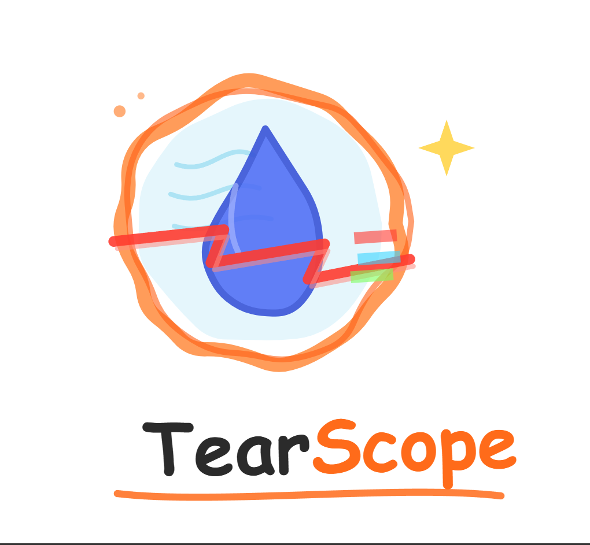

    

# TearScope - v1.1.1
###### a raw video analysis tool

## What it does

TearScope looks at a raw (uncompressed) video and figures out the *real* framerate — not just what the file says it should be.

Normally you'd use a capture card to record a console's video output at some fixed framerate. But the actual framerate can vary, so TearScope compares each frame to the next one, counts how many are actually different, and works out the real framerate from that. It does the same thing for frametime (how long each frame stays on screen), and it can also catch screen tears and factor them into both numbers.

## Examples

    
    
    

## Downloads

Check the [release page](https://github.com/aksdhama0067/tearscope/releases) for the Windows installer. Linux and MacOS builds aren't out yet, but they're on the list.

Running into a bug? Open an [issue](https://github.com/aksdhama0067/tearscope/issues?q=is%3Aopen+is%3Aissue) — it's worth checking the [closed ones](https://github.com/aksdhama0067/tearscope/issues?q=is%3Aissue+is%3Aclosed) first in case it's already been fixed. If you're requesting a feature, a screenshot or mockup of what you have in mind helps a lot.

## Features

- Compare up to 3 videos side by side, any resolution or framerate
- Export as an image sequence (.png or .jpg), 16:9 supported
- Framerate estimation, with a plot and a text overlay you can style yourself (font, color, position)
- Frametime estimation, also with a customizable plot
- Tear detection, including an option to not let complementing tears affect the framerate
- CSV export for both framerate and frametime
- Export the visual overlay or the raw difference frames

Check out [DEVELOPMENT_HISTORY.md](DEVELOPMENT_HISTORY.md) if you want to see gifs from along the way — more of a devlog than documentation.

## Disclaimer

This is a free, open-source project worked on in spare time, so it's not going to be perfect. It's meant as a demonstration of the algorithms involved, not a precise scientific instrument — please don't treat the numbers it gives you as authoritative, and we're not responsible for how the results get used or interpreted.

## Contributing

Built with [Qt](https://www.qt.io/) and [OpenCV](https://opencv.org/). If you want to help out or just get it running locally, [DEVELOPMENT.md](DEVELOPMENT.md) walks through the setup.

## License

[MIT](https://en.wikipedia.org/wiki/MIT_License) — commercial use is fine.
